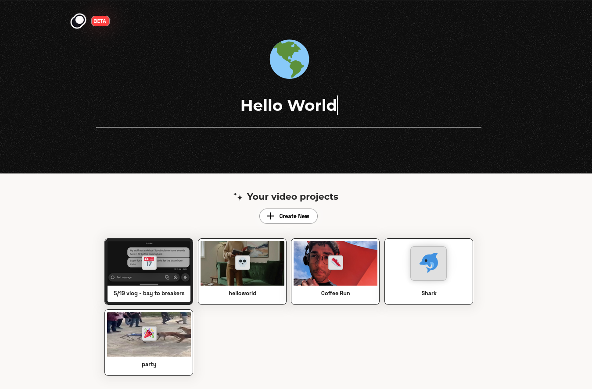
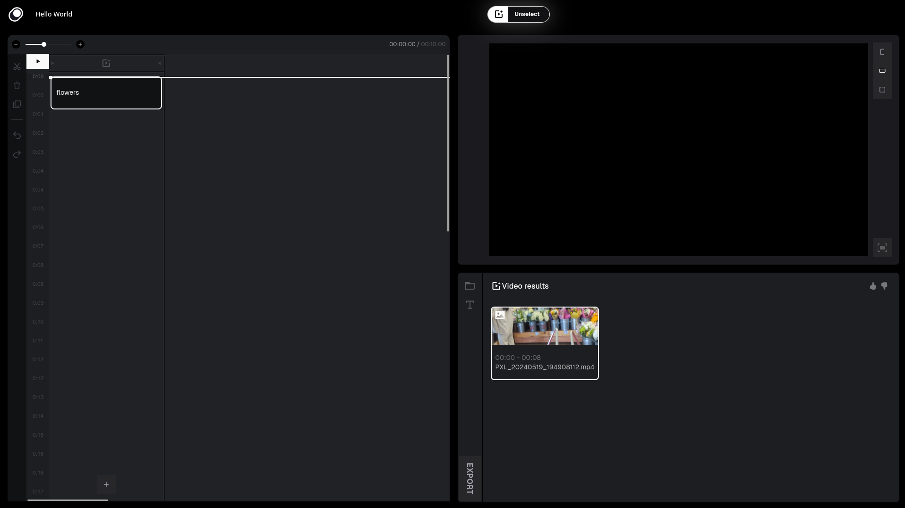

# First Time User Guide   
# The Big Idea   
Video editing is a tedious process that can take hours. That's why we designed a video editor that's made to be faster and easier to learn. If you're someone coming from a traditional video editing software or this is your first time editing a video, this guide will give you an overview of how to edit with moonshine and get you started on creating your first moonshine project.   
# Creating a Project   
Lets get started by logging in and creating your first project by clicking the + Create New button and naming this project Hello World and hitting enter.   
    
Which will take us to the new project:   
    
# Understanding the UI   
Moonshine's interface can be divided into three zones, the header, timeline, view box, and dynamic zone and menu:   
    
Here is some more specific information about the UI:   
    
In the header, double click the title to change your project's name and click on the home button to go back to the project page.   
   
In the timeline, the left hand toolbar has the timeline functionalities of cut, delete, duplicate and undo/redo buttons. You can control the zoom of the timeline with the slider and two buttons at the top. Pause and play the video using the large white play button. All new projects will start with a search box to search your footage. You need to upload footage before making searches. At the bottom of magic tracks, which are distinguished by the video icon with a plus, are a button to create a new search box.   
   
The view box has three buttons for aspect ratios. At the bottom is a button for auto center which brings the footage are into view.   
   
The dynamic menu has a button to manage uploads which is open by default and is the folder icon. Below it is the button to add text. Clicking it will add an object to the timeline which can then be modified.    
# Uploading Your Content   
Start by clicking on the folder icon (at the top of the dynamic menu) to open up the uploads management page:   
    
Drag files over or click on the grey outlined area to upload your files. You will see all you uploads in the current uploads section and in the header.    
    
The header icon is gray when it is uploading and it turns blue once its indexing.    
   
By clicking on the Image, Video, and Audio tabs we can see all of our uploads.   
# Adding Footage to the Timeline   
## Searching for Content   
It's time to make our first search. We can only make searches if you you uploaded footage to the project. If you haven't you will see this:   
    
Let's make our first search! Let's find flowers!: Type your search in and hit enter.   
    
Click on a result to get a preview of the found clip:   
    
To exit preview mode, click the exit button in the notification at the top of the page. To add the video to the timeline at the searchbox position, double click the search result or hit enter. We're going to add this to our timeline giving us:   
    
It is important to note that search for content will only give video results, not images or audio content.   
   
Searching will select the new search. To unselect a timeline element, click the unselect button in notification bar or hit escape.   
## Adding Uploads to the Timeline   
We can also add direct uploads to the timeline. This allows you to add all types of media, audio, image, and video, to the timeline. To do this we can once again navigate to the uploads management page by clicking on the folder icon at the top of the dynamic menu and then clicking on the type of media you want to add.    
   
Let's start by adding an image.    
    
By clicking on an image, we can open it into preview mode allowing us to zoom into the image.    
    
Clicking on the button at the bottom right of the view box will center the image in the view box if it cannot be found. To exit preview mode, click the exit button in notification bar or hit escape. To add the image to the timeline at the cursor position double click on the image or click enter while previewing it.   
    
To add audio and video, the process is the exact same. To add video files, open the uploads manager, select the video tab in the upload manager, select the video to preview it, and then double click the video or hit enter while previewing it to add it to the timeline at the cursor position.   
    
To add audio files, open the uploads manager, select the audio tab in the upload manager, select the audio file to preview it, and then double click the audio file or hit enter while previewing it to add it to the timeline at the cursor position.   
    
# Adding Text    
To add text click the text icon which is second to the top in the dynamic menu or hit the 'T' key. This will create a new text track on the timeline at the cursor position and select it opening the text modification menu in the dynamic zone.   
    
To modify the text double click the apparent text in the view box. Text properties like color and font can be changed in the dynamic zone below.   
    
The length that the text appears in the video can be changed by dragging the text out in the timeline view.   
    
To unselect the text item click unselect in the notification bar or hit escape.   
# Modifying Timeline Track Items   
Any of the elements in the timeline can be selected and their properties can be changed in the dynamic zone. All media with image data (video, image) have sliders for opacity. All media with audio (video, audio) have audio sliders. From left to right below: Image, video, audio.   
    
    
    
Selecting videos will also show similar clips. The similar clips will change depending on where the cursor is on the video and will show clips similar to the current frame.   
    
    
To unselect a timeline element, click the unselect button in notification bar or hit escape.   
   
Finally, all elements on the timeline can be dragged around to make them play at different times.   
# Exporting a Video   
To export a video, click the export button at the bottom of the dynamic menu.   
    
You can choose the export resolution and exported file format. Click the now white export button at the bottom of the dynamic menu again to begin the export.   
    
Once the video is done rendering a download button will appear in the notification bar. Old exports can be found in the previous exports section where they can be previewed by clicking on them and downloaded by clicking within the preview.   
    
